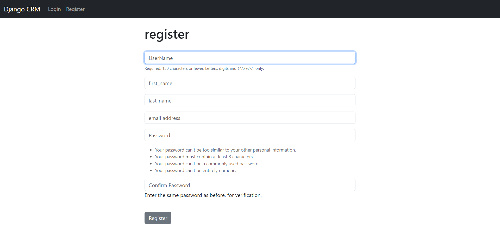
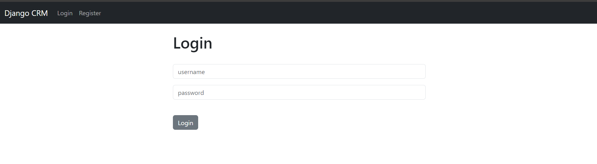
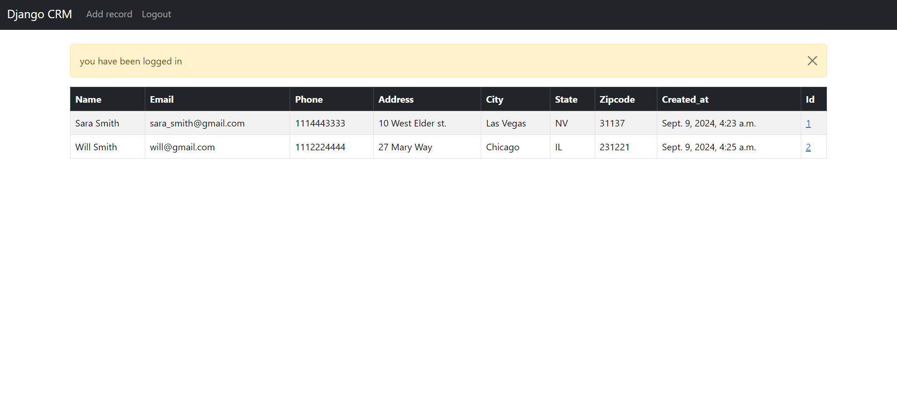
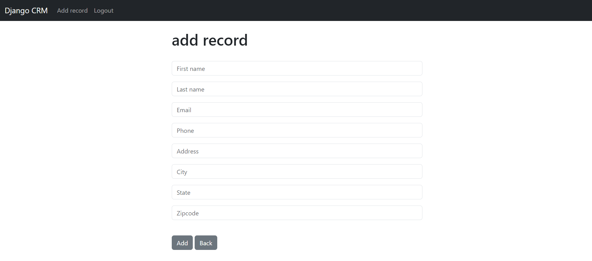
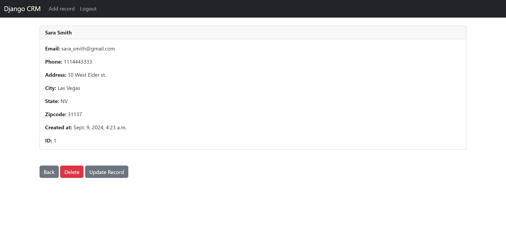

# Django-CRM
Basic CRUD website built with Django and Bootstrap .
<br>
It helps you store and manipulate your records easily and quickly.
<br>
It was made for training purpose .

## Table of Contents
  - [Table of Contents](#table-of-contents)
  - [About the Code](#about-the-code)
  - [Features](#features)
  - [Prerequisites](#prerequisites)
  - [Getting Started](#getting-started)
  - [License](#license)

## About the Code

This project is a web page, made with django and bootstrap.

## Features

- Register : you need to make an account in order to be able to use the website with all features.
  this is the registeration page:
  <br>

  
 - Login : once you have an account you can login to access all features.
  this is the login page:
 <br>


- View home page : you can view all the records that were added by you or by other accounts.
  <br>
 

- Add new record : you can add a new record easily.
  <br>
 

- View and manipulate sigle record : you can view each record individually and either delete it or update it.
  <br>
 

## Prerequisites

Before you use this webiste, you need to have:

- Python installed on your machine.
- Django installed on your machine.

## Getting Started

1. Clone this repository to your local machine.

    ```shell
    git clone https://github.com/Ranc0/Django-CRM
    ```

2. install python from the officail website ( if you don't have it already)

    ```
   https://www.python.org/ftp/python/3.12.5/python-3.12.5-amd64.exe
    ```

3. install the requirements specified in the file provided like this :

    ```shell
      pip install -r requirements.txt
    ```
4. get your secret key by typing this in shell:

    ```shell
     from django.core.management.utils import get_random_secret_key
     get_random_secret_key() 
    ```
5. copy your secret key

6. open settings.py file in dcrm folder and update the sercet key with your new one

7. make sure your cmd path is in the root directory ( where you can see manage.py) 

8. run the server on your localhost 
    ```shell
     python manage.py runserver
    ```
9. open the website in your browser by typing this in url :
    ```
    localhost:8000
    ```
## License

This project is licensed under the [MIT License](LICENSE).

  


